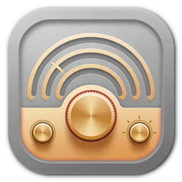
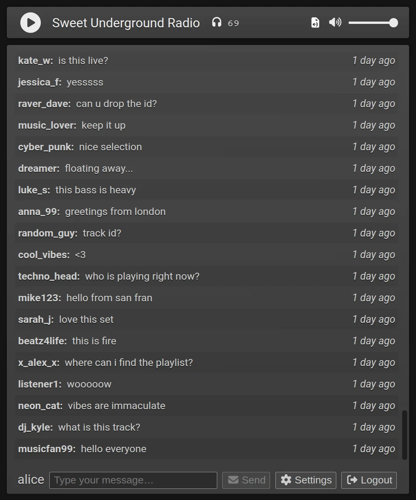

<p align="center">
  
</p>

# TinyStation

[](LICENSE.txt)
[](https://www.typescriptlang.org/)
[](https://react.dev/)
[](https://fastify.dev/)

> TinyStation is an open-source web radio application that combines live audio streaming with real-time chat functionality.

## ✨ Highlights

- Live Icecast audio streaming with real-time metadata
- Real-time chat
- Automatic email notifications when the stream goes live
- Minimal, sleek, and easy-to-use interface

## 📋 Overview

TinyStation is an open-source web radio app that lets you tune in to a single live station and chat with other listeners in real time. Users can register and log in to join the community, listen to the stream, and participate in the conversation; all from a single, simple interface, and it’s completely self-hosted.

<p align="center">
  
</p>

## ⚡ Quick Start

TinyStation is a multi-service application requiring Redis for persistence, Icecast for streaming, and a mail service for notifications.

```bash
# Copy environment file and customize
cp .env .env.local
# Edit .env.local with your settings

# Generate local certificates and start all services
bash docker/start-local.sh
```

This script automatically:
- Generates self-signed certificates using [mkcert][mkcert]
- Builds and starts all services via Docker Compose

Access the application
- Frontend: https://localhost
- [Icecast][icecast] web interface: https://localhost:4443
- [Mailpit][mailpit] web interface: http://localhost:8025

## 🚀 Deployment

### Required Services

TinyStation requires these additional services to function:

| Service                                  | Purpose                           |
| ---------------------------------------- | --------------------------------- |
| [**Icecast**][icecast]                   | Audio streaming server            |
| **Redis/Valkey**                         | Data persistence                  |
| **Mail** (e.g. Postfix, …)               | Email notifications               |
| **Reverse Proxy** (e.g. nginx, Caddy, …) | Reverse proxy and SSL termination |

### Docker Compose Deployment

A minimal [Docker Compose stack](./compose.yml) is provided for testing and experimentation only. It is not
production-ready. The included Dockerfiles and configuration are intended as a starting point for
building a production deployment and will require adaptation and hardening.

### Configuration

TinyStation uses environment variables for configuration. Two files are used:

- [**`.env`**](./.env): Default configuration template
- **`.env.local`**: Your local overrides

## 📦 Packages

| Package                                          | Description                                      |
| ------------------------------------------------ | ------------------------------------------------ |
| [`@tiny-station/frontend`](./packages/frontend/) | React application with chat UI and stream player |
| [`@tiny-station/server`](./packages/server/)     | Fastify backend with Socket.IO and REST APIs     |
| [`@tiny-station/common`](./packages/common/)     | Shared types and utilities                       |

## 🛠️ Development

```bash
# Start development servers
pnpm run server:dev   # Backend (Fastify + Socket.IO)
pnpm run frontend:dev # Frontend (React + Vite)

# Lint and format
pnpm run lint
pnpm run lint:fix
pnpm run format

# Type checking
pnpm run ts:check

# Testing
pnpm run test              # All packages
pnpm run test:common       # Common package only
pnpm run test:frontend     # Frontend only
pnpm run test:server       # Server only
pnpm run test:watch        # Watch mode
```

## 🤝 Contributing

Found a bug or have a feature idea? Head over to the [Issues](https://github.com/buzz/tiny-station/issues) page and let us know.

*Contributions are welcome. Feel free to fork and submit PRs.*

## 📄 License

AGPL-3.0-or-later. See [LICENSE.txt](./LICENSE.txt) for details.

[icecast]: https://icecast.org/
[mailpit]: https://mailpit.axllent.org/
[mkcert]: https://github.com/FiloSottile/mkcert
